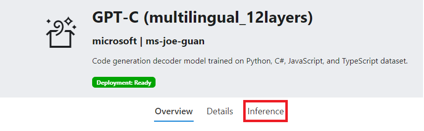

# Getting Started

## Explore Models

You can explore the library of models hosted on Microsoft DeepDev platform via the `Models` tab located at the top of the page. In the model library page, you can see the list of public models along with their name, version, owner, and a short description. Clicking on a model pane will bring you to the model description page, allowing you to see more detailed information as well as perform inference.

## Run Model Inference

There are two main methods to perform model inferencing.

- Go into the a model's overview page by clicking on a model in the `Models` tab. Then select the `Inference` link located near the top of the page.

- Using the inference API located in the [API page](https://deepdev.microsoft.com/api#get-/inference/-name-/-version-/-owner-).

_Note: each model has different payload format requirements that can be found in the respective model overview page. Including an empty, partial, or misformatted payload may result in an exception or other unexpected result._

## Register Model

During the Preview period, only Microsoft internal users can upload a model onto the DeepDev platform.

To register a new model, follow the steps outlined in [Register New Model](https://deepdev.microsoft.com/docs/Register%20Models/register-new-models).