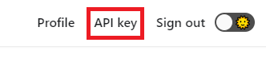

# How to generate API key

Once you have been granted access to Microsoft DeepDev Private Preview, you can access your API key from the `API key` menu on the top right area of the navigation bar.

Please note that your API key is unique to you and anyone with access to your API key can impersonate you on Microsoft DeepDev.

Should your API key be leaked, you should regenerate a new one immediately, which will invalidate any previously generated keys.

## Regenerate API Key

On the API Key page, simply press the `Generate new` button to generate a new API key.

_Note: regenerating a new API key will invalidate the previous key. Make sure to update your applications._
