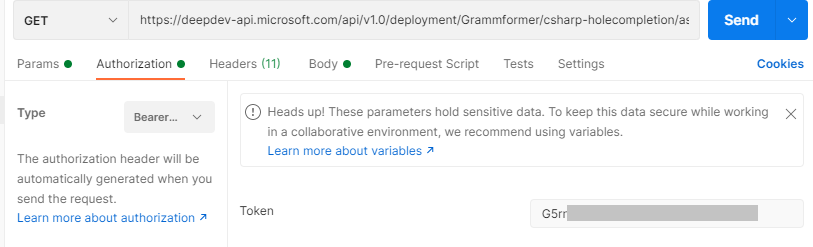

# Accessing the API

There are multiple methods for accessing the Microsoft DeepDev API. In this guide, we will show some of the most common methods.

## Authentcation

Authentication is done using the `Authorization` HTTP header and the value must be `Bearer <API key>`. For more information on how to get your API key, see [Generate API key](/docs/Basics/generate-api-key).

### From Postman

Under the `Authorization` tab, select `Bearer Token` as the `Type` and paste your API key into the `Token` text box.



### From cUrl

Set the `Authorization` header with the value `Bearer <API key>`

Example: `curl -H "Authorization: Bearer <API key>" ...`

### From API playground

After generating an API key, you can access the Microsoft DeepDev API documentation under the `API` tab on the website, which also acts as a playground.

Navigate to the `Authentication` section, and paste the API key into the `HTTP Bearer` field.

Then, click the `SET` button to ensure that the API key is used for subsequent API operations.

### From Python code

Set the `Authorization` header with `Bearer <API key>` in your HTTP request

Example with `requests` library:

```python
import requests

requests.get("https://deepdev-api.microsoft.com/api/v1.0/models", headers={"Authorization": "Bearer <API key>"})
```

## Determining endpoint URL

The full URL path can be composed from the server base path `https://deepdev-api.microsoft.com/api/v1.0` and the endpoint route, seen in the title of every endpoint on the API documentation page.

### Endpoint path parameters

As our API follows the RESTful design, most endpoints accept path parameters.

### Using the API endpoints

Now that you are authenticated, you can access the API endpoints. For each endpoint, after filling out the appropriate parameters you can send the request by pressing the `TRY` button at the bottom of the expanded endpoint container.
